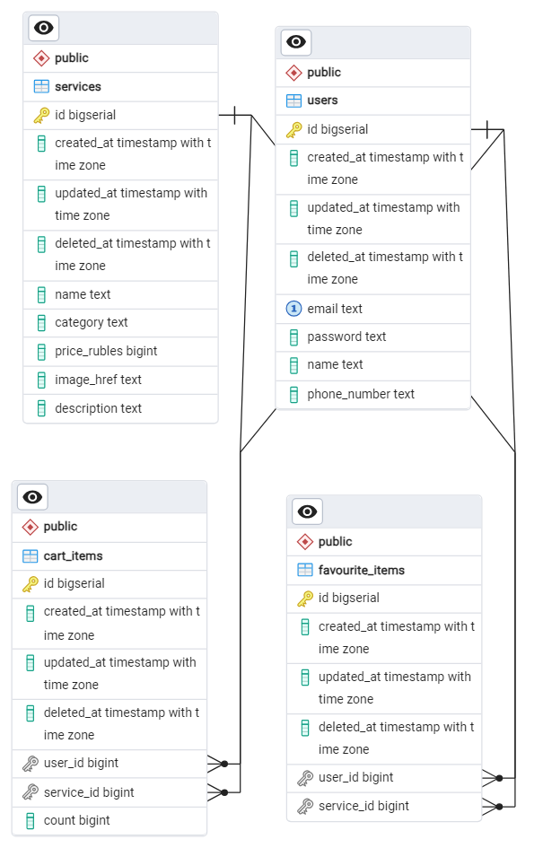
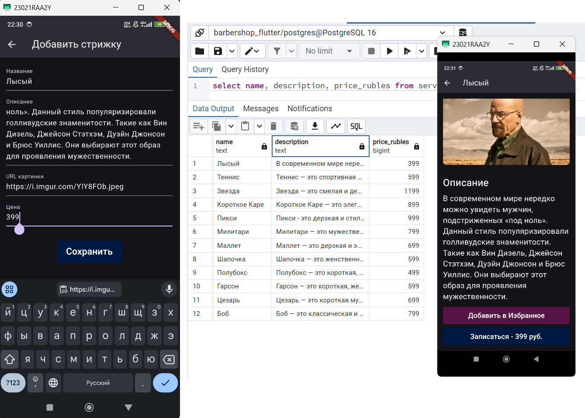
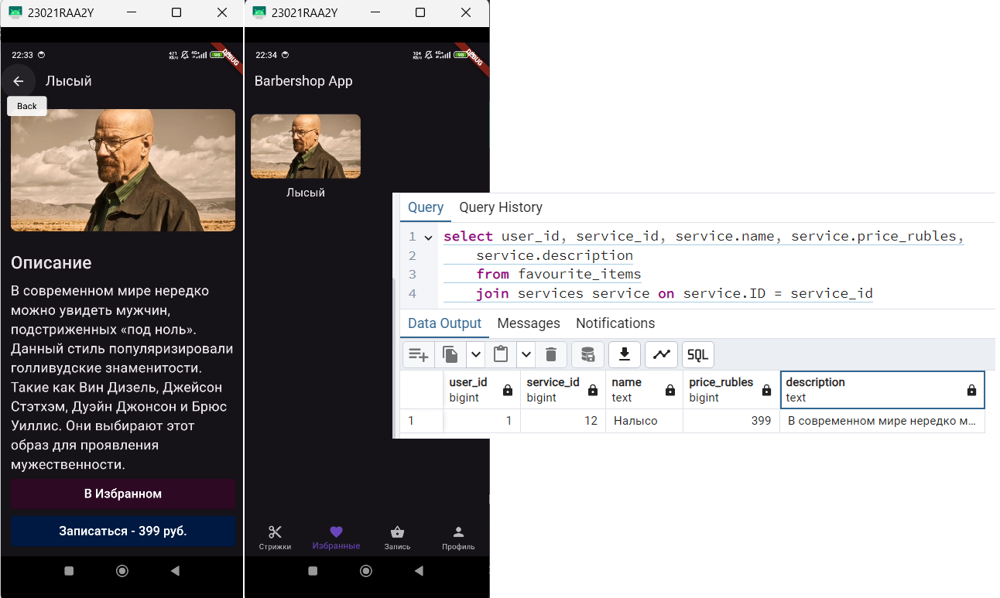
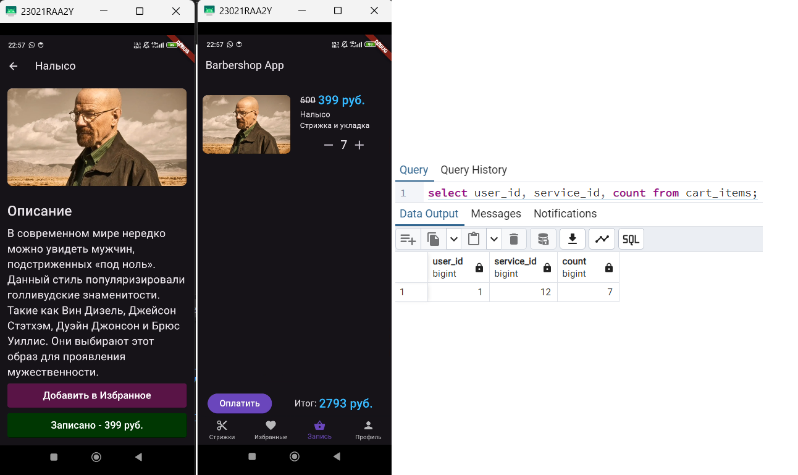
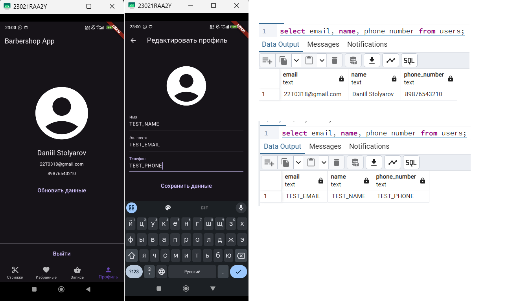

# Практика 7 Столяров ЭФБО-01-22 22T0318

## Задание.
Создать бекенд часть, которая позволит добавлять, удалять и изменять следующие записи:
<ol>
    <li>Стрижки</li>
    <li>Любимые стрижки пользователя</li>
    <li>Корзина стрижек пользователя</li>
    <li>Данные пользователя</li>
</ol>

## Решение
Для реализации будем использовать бекенд на GO, данные будем хранить в БД Postgres, а взаимодействовать с ней - с помощью пакета GORM.

Нам понадобятся следующие таблицы:

<ul>
    <li>users (id, email, password, name, phone_number)</li>
    <li>services(id, name, category, price_rubles, image_href, description)</li>
    <li>favourite_items(id, user_id, service_id)</li>
    <li>cart_items(id, user_id, service_id, count)</li>
</ul>

REST API:
<ul>
    <li>GET /user/?id={...} - возвращает JSON-данные пользователя по id</li>
    <li>PUT /user - отправляет новые JSON-данные пользователя</li>
    <li>GET /services - возвращает JSON со списком стрижек</li>
    <li>POST /service - добавляет новую стрижку</li>
    <li>GET /favourite - возвращает Избранное в JSON</li>
    <li>POST /favourite/?service_id={...} добавляет в Избранное по id услуги</li>
    <li>GET /cart - возвращает Корзину в JSON</li>
    <li>PUT /cart?id={...}&count={...} - изменяет данные элемента корзины (количество)</li>
    <li>POST /cart?service_id={...} - добавляет новый элемент корзины по service_id</li>
    <li>DELETE /cart?id={...} - удаляет элемент корзины по id</li>
    <li>DELETE /favourite?id={...} - удаляет услугу из Избранного</li>
</ul>

## Ход выполнения
### Шаг 1. Создание API на Go

Весь API описан в файле <a href="./backend/backend.go">backend.go</a> и протестирован с помощью <a href="https://elements.getpostman.com/redirect?entityId=24015280-8a099f19-cf00-4125-9654-e3b574800df0&entityType=collection">Postman</a>

### Шаг 2. Отправка запросов с клиента
Теперь по нажатию на кнопки (Добавить в Избранное, Запись, Удалить, Обновить данные пользвателя, +/-, создать стрижку) данные меняются не только локально, но и в БД на стороне сервера.

## Скриншоты
### Диаграмма БД

### Добавить стрижку

### Избранное

### Корзина

### Профиль

